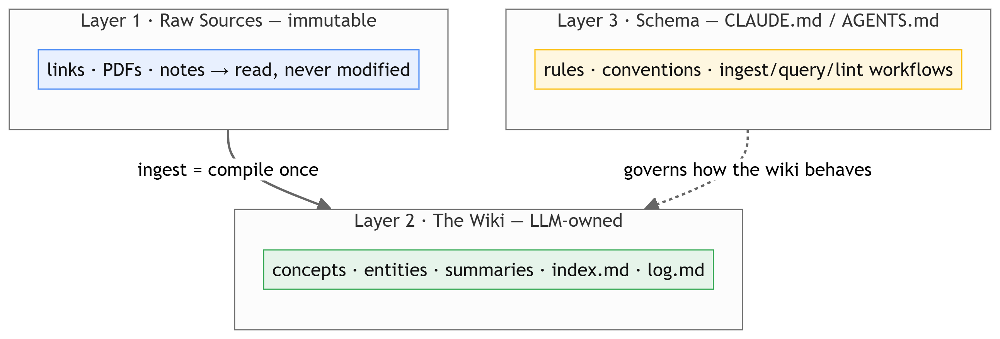
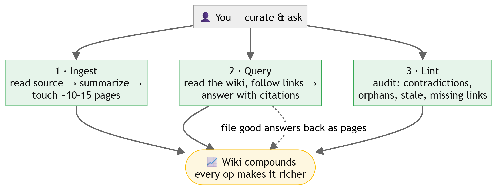

# llm-wiki-wiki

A compounding, LLM-maintained **meta-wiki about the LLM-wiki concept itself** — the
pattern (from Andrej Karpathy) of an AI incrementally building and maintaining a
persistent knowledge base instead of re-running RAG on every query.

It is built as an **[Open Knowledge Format](concepts/open-knowledge-format.md)
(OKF v0.2)** bundle: plain Markdown + YAML frontmatter, readable with `cat`,
diffable in git, and openable as an [Obsidian](entities/obsidian.md) vault.

## How it works

The wiki has three layers (see [Three-layer architecture](concepts/three-layer-architecture.md)):

1. **Raw sources** — `sources/`, one note per external link; immutable, read never rewritten.
2. **The wiki** — `concepts/`, `entities/`, `summaries/`; LLM-generated and cross-linked.
3. **The schema** — [`CLAUDE.md`](CLAUDE.md), which defines the conventions and the
   ingest / query / lint workflows.

Navigation: **[`index.md`](index.md)** catalogs every page; **[`log.md`](log.md)** is
the append-only change history.

## Start here

- **[index.md](index.md)** — the catalog of all pages.
- **[CLAUDE.md](CLAUDE.md)** — the schema / operating manual.
- **[LLM Wiki vs traditional RAG](summaries/llm-wiki-vs-rag.md)** — the central thesis.
- **[OKF vs this wiki's schema](summaries/okf-vs-this-wiki-schema.md)** — how the open standard compares.

## Adding to it

New knowledge is added by *ingesting a source*: hand an LLM agent this repo (the
`CLAUDE.md` schema loads the rules) plus a link, and it reads the source, writes a
source note, updates the related concept/entity pages, and appends to the log.
