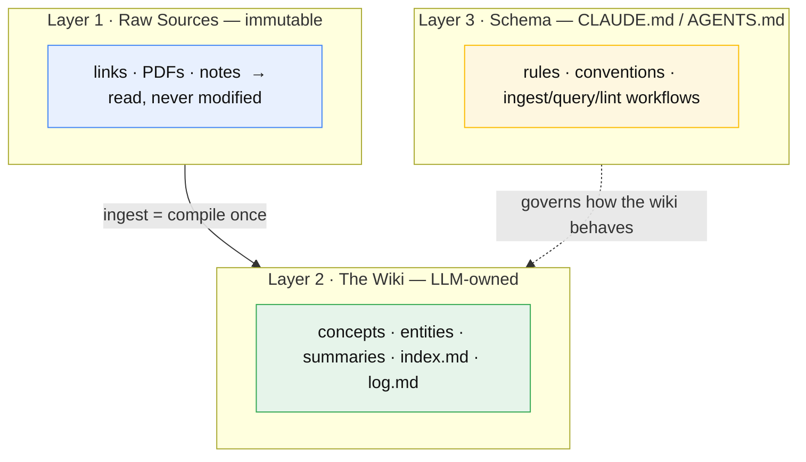

# Three-layer architecture

The LLM-wiki pattern separates knowledge into three distinct layers, each with a
different owner and a different mutability rule. Keeping them separate is what lets
the wiki compound without corrupting its evidence base.

## At a glance

Raw sources are the *source code*, the wiki is the *compiled binary*, and the
schema is the *build configuration* — see [Knowledge as compilation](knowledge-compilation-analogy.md).

## The layers

1. **Raw sources** — Immutable, curated documents (articles, papers, data,
   and in this wiki, mostly *links*). The LLM **reads but never modifies** them.
   In this wiki they live as source notes in `sources/`, which capture each
   source's substance at ingestion time so the record survives link rot.
   See [Karpathy's gist](../sources/source-karpathy-llm-wiki-gist.md).

2. **The wiki** — LLM-generated Markdown the AI **fully manages**: summaries,
   entity pages, and concept pages (this file is one). This is the layer where
   cross-references and synthesis accumulate.

3. **The schema** — A configuration document (`CLAUDE.md` for Claude Code, or
   `AGENTS.md` for Codex-style agents) specifying structure, naming conventions,
   and the workflows for ingestion, querying, and maintenance. It governs *how* the
   wiki behaves; it is not itself wiki content.

The layering maps onto a [compilation analogy](knowledge-compilation-analogy.md):
raw sources are source code, the wiki is the compiled binary, and the schema is
the build configuration.

The **wiki layer** is exactly what the [Open Knowledge Format](open-knowledge-format.md)
standardizes — same markdown + YAML frontmatter, `index.md`, and `log.md` — turning
this personal pattern into an interoperable, exchangeable one.

## Why the separation matters
- **Evidence stays clean.** Because sources are never rewritten to fit
  conclusions, disagreements are recorded on wiki pages rather than hidden by
  editing the underlying record.
- **The wiki can be rebuilt.** If synthesis goes wrong, the source layer is intact
  and pages can be regenerated from it.
- **The schema is swappable.** Conventions can evolve without touching captured
  knowledge.

## Related
- [The three operations](three-operations.md) — ingest / query / lint over these layers.
- [Knowledge as compilation](knowledge-compilation-analogy.md) — the source-code → binary framing.
- [LLM Wiki vs traditional RAG](../summaries/llm-wiki-vs-rag.md) — why this layering compounds.
- Sources: [Karpathy — LLM Wiki gist](../sources/source-karpathy-llm-wiki-gist.md) · [Joshi — walkthrough](../sources/source-joshi-medium-llm-wiki.md)
