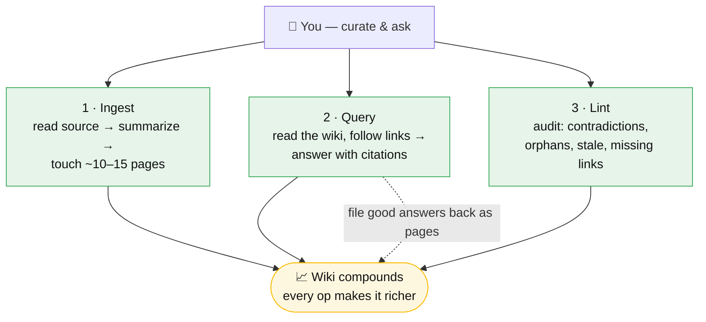

# The three operations

The LLM-wiki pattern runs on three operations. The human curates and asks; the
model does the rest, and every operation makes the wiki richer.

## At a glance

## 1. Ingest
Drop a new source into the raw layer. The model reads it, writes a summary page,
and *touches related pages* — updating, cross-linking, and flagging
contradictions. A single article can ripple into ~10–15 page updates rather than a
single new file. This is where [compilation](knowledge-compilation-analogy.md)
happens.

## 2. Query
Ask a question. The model reads the **already-synthesized wiki** — not the raw
documents — follows the links between pages, and answers with citations. The
compounding trick: a good synthesized answer can be **filed back** as a new page,
so explorations become permanent knowledge.

## 3. Lint (maintenance)
Periodically audit the whole wiki: find contradictions, orphan pages (nothing
links in), stale claims, and concepts mentioned but missing their own page. This
is the bookkeeping humans abandon wikis over — and the reason the pattern needs
an LLM that "doesn't get bored." It's also the safeguard against the
[hallucination-baking risk](hallucination-baking-risk.md): lint should spot-check
generated pages against raw sources.

## Note on naming
Karpathy's gist calls these ingestion / querying / maintenance; Joshi reframes the
third as **lint** (a health-check pass, borrowing the software term). Same
operation, different label.

## Sources
- [Karpathy — LLM Wiki gist](../sources/source-karpathy-llm-wiki-gist.md)
- [Joshi — LLM Wiki walkthrough](../sources/source-joshi-medium-llm-wiki.md)

## In OKF terms
The [Open Knowledge Format](open-knowledge-format.md) encodes the artifacts these
operations act on: `index.md` supports query-time *progressive disclosure*, `log.md`
records the ingest/lint history, and a bundle's trust and `stale_after` metadata is
what a *lint* pass checks against. See [Provenance and trust](provenance-and-trust.md).

## Related
- [Knowledge as compilation](knowledge-compilation-analogy.md)
- [Three-layer architecture](three-layer-architecture.md)
- [Open Knowledge Format](open-knowledge-format.md)
