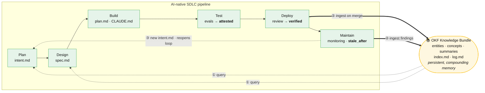

# Applying the LLM wiki to the AI-native SDLC

Anthropic's [AI-native SDLC playbook](../sources/source-anthropic-ai-native-sdlc.md)
is already built on the LLM wiki's substrate — versioned Markdown artifacts and
`CLAUDE.md`. So applying the wiki pattern isn't bolting something on; it's adding
the one layer the pipeline lacks: a **persistent, compounding** knowledge base
beside a pipeline that today produces mostly
[flow-through artifacts](../concepts/flow-through-vs-compounding-artifacts.md).

## At a glance

**① Read early, ② write late, ③ loop back.** Plan and Design *query* the bundle (so
specs are drafted against everything already known); Deploy and Maintain *ingest*
into it (so every shipped change and incident compounds); Maintain's findings reopen
the loop as new `intent.md`. The OKF governance features are folded into the stages
where stakes are highest — [attestation](../concepts/attested-computation.md) at
evals, the [verified trust tier](../concepts/provenance-and-trust.md) at review,
`stale_after` at monitoring.

## The gap
`intent.md → spec.md → plan.md` are scoped to a single feature and archived once it
ships; `CLAUDE.md` is capped at ~one page. Knowledge doesn't compound across
features, so every new plan re-derives context about the affected system. In the
[compilation analogy](../concepts/knowledge-compilation-analogy.md), the SDLC
artifacts are source code flowing through; the wiki is the compiled binary of
institutional knowledge that grows with every shipped change. `CLAUDE.md` stops
being the knowledge and becomes the **schema/index** pointing into the wiki.

## The mapping
| LLM wiki | AI-native SDLC |
|---|---|
| Raw sources (captured, immutable) | Merged `intent.md` / `spec.md` / `plan.md`, PRs, incident reports, eval runs |
| Ingest | Merge or closed incident → compile into the knowledge base |
| Query | Plan/Design reads the wiki instead of re-scanning the repo |
| Lint | Maintain stage: stale decisions, drift, orphaned services |
| entities/ | Services, modules, systems, teams, dependencies |
| concepts/ | Architecture patterns, decisions (ADRs), failure modes, conventions |
| summaries/ | End-to-end domain overviews |
| index.md / log.md | Catalog of the system + audit trail of what changed and why |

## The three operations, in the loop
- **Ingest** — a hook on merge (the playbook already uses hooks as deterministic
  gates) fires ingestion: read the merged intent/spec/plan + diff, update the
  service's entity page, record the decision as an ADR concept page, cross-link,
  and log. One merge → a web of updates.
- **Query** — at Plan/Design, drafts are written *against the wiki*: "what do we
  know about this service — owners, prior incidents, past decisions, failure
  modes?" The model reads pre-synthesized pages, not the raw repo. See
  [The three operations](../concepts/three-operations.md).
- **Lint** — the Maintain stage's monitoring already writes findings as new
  `intent.md`; that doubles as a lint trigger when a finding contradicts an
  existing ADR.

## Why OKF matters more here than in a personal wiki
A codebase raises the stakes, so the
[hallucination-baking risk](../concepts/hallucination-baking-risk.md) is real — a
wrong "fact" about the auth flow could mislead the pipeline. OKF's machinery maps
onto the playbook's governance:
- **[Trust tiers](../concepts/provenance-and-trust.md)** (`generated` vs `verified`)
  ↔ the playbook's separation of duties; PR review promotes a page to
  `human-reviewed`.
- **`stale_after`** ↔ control-band breaches; lint flags expired specs/decisions.
- **[Attested Computation](../concepts/attested-computation.md)** ↔ evals/CI: store
  the sanctioned query for facts like latency, coverage, or PII-touching endpoints,
  re-run it, and refuse to show stale/failed numbers rather than asserting them.

## The governance parallel
The wiki is **advisory memory** (like Skills); **hooks and human review stay the
deterministic gates**. "The loop keeps running. Human judgement stays above it" —
the wiki lives *inside* the loop, never above it. Code stays ground truth; the wiki
compiles knowledge *about* the code, with the risky facts attested rather than
asserted.

## A concrete build
A `knowledge/` OKF bundle in the repo (or one central bundle across repos),
`CLAUDE.md` pointing Claude to query it during Plan/Design, a merge hook that
ingests each shipped change, and the Maintain stage's `intent.md` findings wired in
as ingestion events — closing the playbook's loop *through* a compounding memory
instead of past it.

## Sources
- [Anthropic — AI-Native SDLC Playbook](../sources/source-anthropic-ai-native-sdlc.md)
- [OKF Specification v0.2](../sources/source-okf-spec.md)
- [Karpathy — LLM Wiki gist](../sources/source-karpathy-llm-wiki-gist.md)

## Related
- [Flow-through vs compounding artifacts](../concepts/flow-through-vs-compounding-artifacts.md)
- [Open Knowledge Format](../concepts/open-knowledge-format.md) · [Three-layer architecture](../concepts/three-layer-architecture.md)
