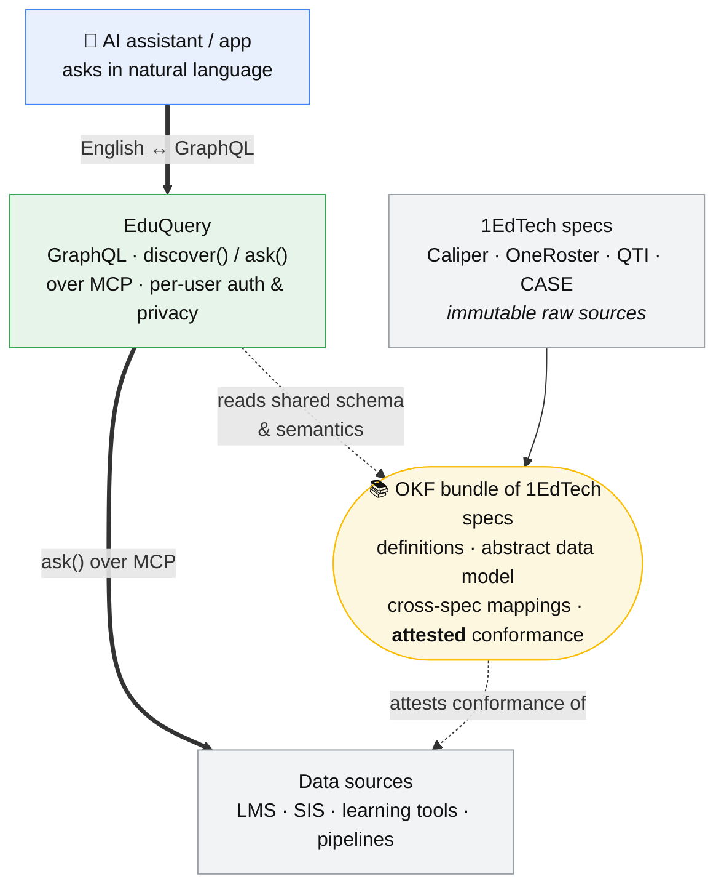

# Applying OKF / the LLM wiki to 1EdTech specs

The [EduQuery deck](../sources/source-1edtech-eduquery-ai-ready-query.md) needs one
thing it can't get from a query protocol alone: a **shared, authoritative,
machine-readable definition of what education data means**, plus a way to check that
an implementation actually follows it. That is precisely what an
[Open Knowledge Format](../concepts/open-knowledge-format.md) bundle provides. So the
LLM-wiki pattern maps onto 1EdTech in a very direct way: **an OKF bundle of 1EdTech
specs as the semantic + conformance layer behind EduQuery.**

## At a glance

**EduQuery is the access surface; the OKF bundle is the meaning behind it.** The AI
queries in English; EduQuery translates to GraphQL and fetches over MCP; the bundle
supplies the shared schema and definitions EduQuery aligns to, and *attests* that a
data source's endpoint conforms to the standard. The 1EdTech specs stay immutable
raw sources feeding the bundle.

## Two problems, one bundle
The deck names two blockers OKF is well shaped for:
1. **Unified semantics** — "no common definition of what it means." See
   [the unified-semantics gap](../concepts/unified-semantics-gap.md).
2. **Proper implementation** — institutions "expose data differently"; nothing
   proves a given endpoint conforms to the standard.

## The mapping
| OKF bundle of specs | 1EdTech / EduQuery |
|---|---|
| Raw sources (immutable) | The normative spec documents (Caliper, OneRoster, LTI, QTI, CASE, …) |
| entities/ | One page per spec, and per data-model object (Result, LineItem, Assessment, Enrollment) |
| concepts/ | Shared term definitions ("completion", "grade"), cross-spec mappings, conformance rules |
| summaries/ | The **abstract data model** EduQuery aligns to — the cross-spec overview |
| index.md / log.md | Catalog of the standards + a versioned history of definition changes |

## Unified semantics
Each term is defined **once**, in one place, and cross-linked. An AI (via EduQuery's
GraphQL schema and its "prompts/instructions for MCP hosts") reads the definition
instead of inferring it from a field name — closing the meaning half of the gap. The
deck's "common abstract data model aligned with existing 1EdTech standards" *is* this
bundle's summary layer; EduQuery supplies **access + query**, the bundle supplies
**meaning + conformance**.

## Conformance assurance (the strong part)
This is where OKF's governance features earn their place — exactly your "assure
proper implementation of standards":
- **[Attested Computation](../concepts/attested-computation.md)** — encode a spec's
  conformance rule as a *sanctioned, runnable check*. An institution's EduQuery
  endpoint output can be run through the attested validator to **prove** it conforms,
  rather than asserting it does. "Does this implementation follow the standard?"
  becomes a re-runnable gate, not a prose claim.
- **[Verified trust tier](../concepts/provenance-and-trust.md)** — a definition or
  mapping reviewed by 1EdTech is `human-reviewed` (authoritative); a machine-drafted
  one is provisional. Consumers can gate on tier.
- **`stale_after`** — when 1EdTech ships a new spec version, the lint pass flags every
  dependent definition and mapping as stale, so the semantic layer tracks the standard
  instead of drifting from it.

## How EduQuery and MCP consume it
[MCP](../concepts/model-context-protocol.md) is the pipe (access); EduQuery is the
query surface (GraphQL + `discover()`/`ask()`); the OKF bundle is the meaning and
conformance behind both. EduQuery's Query Schema and host instructions can be
generated from — or point directly into — the bundle, so the "shared schema" the deck
promises is literally the bundle served to agents.

## The compounding payoff
As institutions implement and their conformance results and local mappings are
ingested back, the bundle accumulates a live picture of *who implements what, and how
well* — which is the deck's second use case (institution-wide insights) emerging from
the knowledge layer rather than from bespoke pipelines.

## The one caveat
The bundle must never become an **unaudited second source of truth** that drifts from
the normative specs. Keep the spec documents as immutable
[raw sources](../concepts/three-layer-architecture.md); the bundle *synthesizes and
maps*, and **attests against** the spec rather than restating it — the
[hallucination-baking risk](../concepts/hallucination-baking-risk.md) is acute when
the "facts" are standards other systems must obey.

## Sources
- [1EdTech — EduQuery deck](../sources/source-1edtech-eduquery-ai-ready-query.md)
- [OKF Specification v0.2](../sources/source-okf-spec.md)
- [Google Cloud — OKF blog](../sources/source-google-okf-blog.md)

## Related
- [The unified-semantics gap](../concepts/unified-semantics-gap.md) · [EduQuery](../entities/eduquery.md) · [Model Context Protocol](../concepts/model-context-protocol.md)
- [Applying the LLM wiki to the AI-native SDLC](llm-wiki-applied-to-sdlc.md) — the same move for a different domain.
