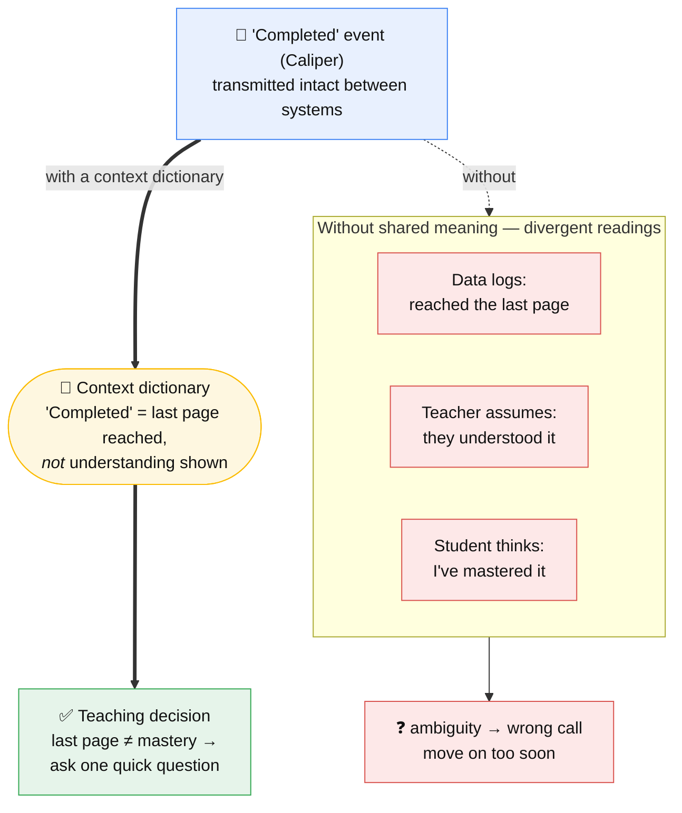

# One Data, One Meaning

The [Molenaar & Nörenberg talk](../sources/source-molenaar-one-data-one-meaning.md)
(Learning Impact Europe 2026) is this wiki's capstone: it takes every thread the
wiki has ingested and lands them on one problem in learning analytics — **the data
is interoperable, but its interpretation is not** — and one answer: publish the
shared meaning as an OKF/LLM-Wiki bundle.

## At a glance

**Same event, two fates.** Without shared meaning the "Completed" event scatters into
three private readings and a wrong call; run through a
[context dictionary](../concepts/context-dictionary.md) it resolves to one meaning the
teacher can act on. The data was always interoperable — the *dictionary* is what makes
the interpretation interoperable too.

## The gap it names
EdTech standards deliver strong *technical* interoperability: events flow intact
between platforms. But the same Caliper "Completed" event is read three ways — the
data logs "reached the last page," the teacher assumes understanding, the student
assumes mastery. Interoperable transport, incompatible interpretation. This is the
[unified-semantics gap](../concepts/unified-semantics-gap.md) made vivid.

## The answer: a context dictionary
"Shared meaning turns the same data into a teaching decision." A
[context dictionary](../concepts/context-dictionary.md) states each term's meaning
once and authoritatively ("Completed" = last page reached, not understanding shown),
so the event becomes actionable. Published as an [OKF bundle](../concepts/open-knowledge-format.md),
that dictionary is readable by humans *and* agents — "one architecture can serve
humans and Agents alike."

## How it assembles the wiki's parts
The talk walks the exact stack this wiki has built up:
- **1EdTech standards** (OneRoster/EduAPI, Caliper/xAPI, LTI, QTI, CASE) — the
  interoperable-transport layer. See [1EdTech](../entities/1edtech.md).
- **[MCP](../concepts/model-context-protocol.md) & [EduQuery](../entities/eduquery.md)** —
  access and query (Couper's experiment: EduAPI/Caliper in, GraphQL, out over
  MCP/LTI/REST).
- **[LLM Wiki](../sources/source-karpathy-llm-wiki-gist.md) & [OKF](../concepts/open-knowledge-format.md)** —
  the compounding, machine-readable knowledge layer that supplies meaning.
- **PoC:** [Caliper Analytics](../entities/caliper-analytics.md) as an OKF/LLM-Wiki
  bundle, built with just two components — a Markdown editor (Obsidian) + an agent
  harness (Claude Code).

## Next steps it sets
- Define an **[OKF profile for EdTech](../concepts/okf-profile.md)** (agreed
  metadata fields/tags).
- Apply the pattern to Caliper (a "Context Dictionary OKF"), OneRoster/EduAPI, QTI,
  LTI, CASE, the Student Learning Data Model — and feed those specs into
  [AI-native SDLCs](llm-wiki-applied-to-sdlc.md).
- Revisit EduQuery with LLM-Wiki/OKF context attached.

## The self-referential loop
The talk cites this repository as a source. So the wiki is both the **method** it
describes and an **artifact** of the work it reports — the compounding knowledge
base feeding the very presentation that argues for compounding knowledge bases.
That loop is the pattern working as intended, seen from the outside.

## Sources
- [Molenaar & Nörenberg — One Data, One Meaning](../sources/source-molenaar-one-data-one-meaning.md)
- [1EdTech — EduQuery deck](../sources/source-1edtech-eduquery-ai-ready-query.md)
- [1EdTech (Aracil) — standards adoption](../sources/source-aracil-standards-adoption.md)
- [Karpathy — LLM Wiki gist](../sources/source-karpathy-llm-wiki-gist.md)
- [Google Cloud — OKF blog](../sources/source-google-okf-blog.md)

## Related
- [Applying OKF to 1EdTech specs](okf-for-1edtech-specs.md) · [Context dictionary](../concepts/context-dictionary.md) · [OKF profile](../concepts/okf-profile.md)
